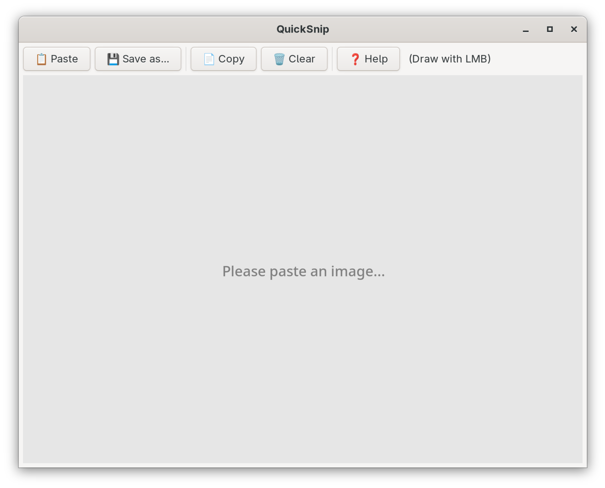

# QuickSnip

A simple paint tool for GNOME/Linux to quickly annotate images from your clipboard.



## Features

- Paste images from clipboard
- Draw annotations with a red pen
- Zoom in/out with Ctrl + scroll wheel
- Copy annotated image back to clipboard
- Save as PNG

## Installation

### Requirements

- Python 3
- PyGObject
- GTK 3
- cairo (PyCairo)

### Install dependencies

```bash
# Fedora
sudo dnf install python3-gobject gtk3 cairo-gobject

# Ubuntu/Debian
sudo apt install python3-gi gir1.2-gtk-3.0 python3-cairo

# Arch
sudo pacman -S python-gobject gtk3 cairo
```

Install Python dependencies:

```bash
pip install PyGObject
```

### File manager integration (optional)

To make QuickSnip show up in the "Open With" menu for image files in Files (Nautilus), save the following to `~/.local/share/applications/quicksnip.desktop`, replacing the two `/path/to/...` lines with wherever you cloned the repo:

```ini
[Desktop Entry]
Name=QuickSnip
Comment=Quickly annotate images from your clipboard
Exec=/path/to/quicksnip.py %f
Icon=/path/to/screenshot.png
Terminal=false
Type=Application
Categories=Graphics;Utility;
MimeType=image/png;image/jpeg;image/gif;image/bmp;image/webp;image/tiff;
Keywords=Screenshot;Annotate;Paint;
StartupNotify=true
```

Make the script executable and refresh the desktop database:

```bash
chmod +x /path/to/quicksnip.py
update-desktop-database ~/.local/share/applications/
```

QuickSnip will then appear under "Open With Other Application" for common image types. This does **not** change the default image viewer.

## Usage

```bash
python3 quicksnip.py                      # Start empty, paste image later
python3 quicksnip.py /path/to/image.png   # Open an image file directly
```

### Controls

| Action | Input |
|--------|-------|
| Paste image | Ctrl+V or click "Paste" |
| Draw | Left-click + drag |
| Zoom in/out | Ctrl + scroll wheel |
| Copy to clipboard | Ctrl+C or click "Copy" |
| Save as PNG | Ctrl+S or click "Save" |
| Clear canvas | ESC or click "Clear" |

## Workflow

1. Take a screenshot or copy any image to your clipboard
2. Open QuickSnip
3. Paste the image (Ctrl+V)
4. Draw your annotations
5. Copy (Ctrl+C) or save (Ctrl+S)

## License

MIT License

Copyright (c) 2024

Permission is hereby granted, free of charge, to any person obtaining a copy
of this software and associated documentation files (the "Software"), to deal
in the Software without restriction, including without limitation the rights
to use, copy, modify, merge, publish, distribute, sublicense, and/or sell
copies of the Software, and to permit persons to whom the Software is
furnished to do so, subject to the following conditions:

The above copyright notice and this permission notice shall be included in all
copies or substantial portions of the Software.

THE SOFTWARE IS PROVIDED "AS IS", WITHOUT WARRANTY OF ANY KIND, EXPRESS OR
IMPLIED, INCLUDING BUT NOT LIMITED TO THE WARRANTIES OF MERCHANTABILITY,
FITNESS FOR A PARTICULAR PURPOSE AND NONINFRINGEMENT. IN NO EVENT SHALL THE
AUTHORS OR COPYRIGHT HOLDERS BE LIABLE FOR ANY CLAIM, DAMAGES OR OTHER
LIABILITY, WHETHER IN AN ACTION OF CONTRACT, TORT OR OTHERWISE, ARISING FROM,
OUT OF OR IN CONNECTION WITH THE SOFTWARE OR THE USE OR OTHER DEALINGS IN THE
SOFTWARE.